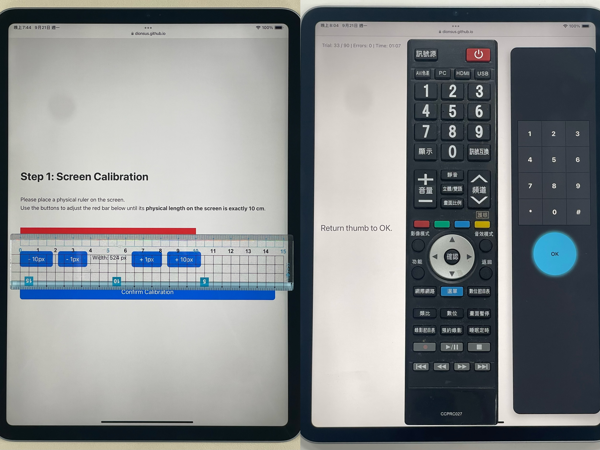
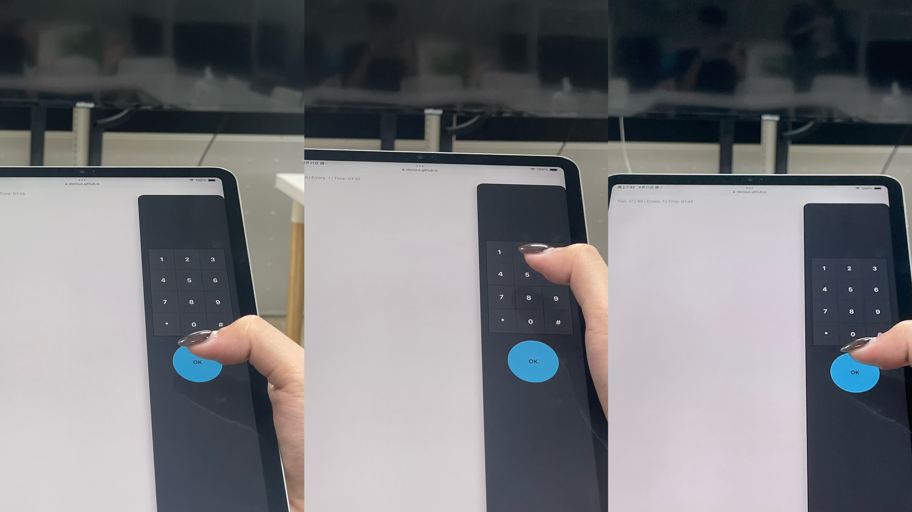
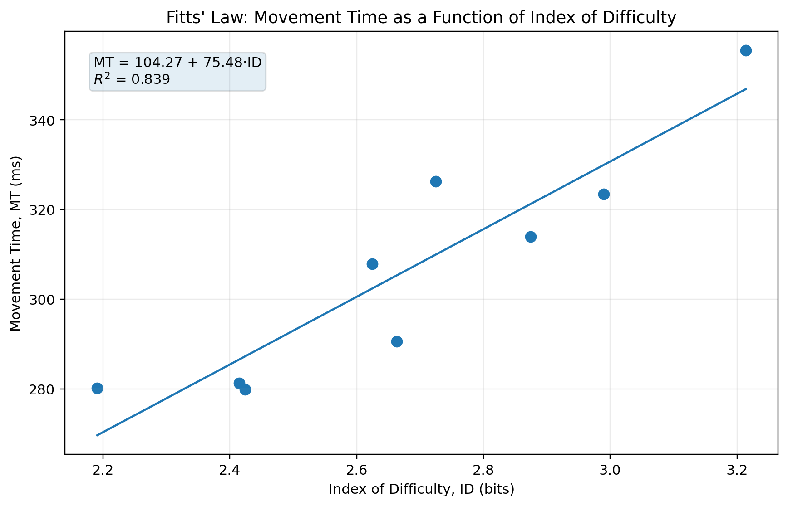

# HCI Assignment 1 - Empirical Analysis of Fitts' Law

## 1. Scenario

This experiment focuses on the situation of using a TV remote control to enter channel numbers while watching television.

## 2. Innovation

When using a remote control, people usually hold the lower half of the remote and naturally rest their thumb around the center area.

However, when entering a channel number, the numeric keypad is often far from this natural thumb position. Users may need to stretch their thumb or change their grip to reach the buttons.

Therefore, this experiment uses Fitts' Law to investigate suitable combinations of numeric button position and button size while maintaining a natural remote-control grip.

## 3. Experiment Design

The experiment interface is designed based on the physical dimensions of a real TV remote control.

Three target distances (A) and three button sizes (W) are used, resulting in a total of **9 experimental conditions**. Each condition is repeated for **10 trials**, giving **90 trials in total**.

Because different devices may display webpages at different physical scales, the experiment begins with a **screen calibration** step. This ensures that the displayed remote control matches the intended physical dimensions.

 

  

 

The remote control is positioned on the far right side of the screen so that the participant can hold the edge of the tablet with the dominant right hand, simulating a natural remote-control grip. A tablet is used to make the interaction closer to holding and operating a real remote control.

### Website Preview

[Open the Fitts' Law Remote Control Experiment](https://dionsus.github.io/HCI-Assignment-1-Empirical-Analysis-of-Fitts-Law/HCI_HW1_MingDi_Chung.html)

During each trial, the participant starts with the thumb resting on the **OK button** near the center of the remote control. The participant then moves the thumb to press **Number 5** and returns to the OK button before the next trial.

 

  

 

The 9 distance-and-size conditions are presented in randomized order to reduce learning effects caused by repeatedly performing the same movement.

Since repeated thumb movement may cause fatigue, the participant is given a short rest after every **30 trials**.

### Demo Video

 

  <video src="Demo.mp4" width="60%"/>

 

## 4. Result Analysis

The experiment produced a clear relationship between **Index of Difficulty (ID)** and **Movement Time (MT)**.

Using the average MT of the 9 experimental conditions, the fitted Fitts' Law model is:

\[
MT = 104.26 + 75.49 \times ID
\]

with:

\[
R^2 = 0.839
\]

This indicates that the experimental results generally follow the expected Fitts' Law trend: as the target becomes smaller or farther away, the movement time increases.

Among the 9 conditions, **Middle + Large** produced the shortest average movement time at approximately **279.9 ms**, while **Far + Small** produced the longest average movement time at approximately **355.5 ms**.

The difference suggests that smaller buttons and longer thumb travel distances make the numeric keypad more difficult to reach under a natural remote-control grip.

### Fastest and Slowest Conditions

| Fastest Condition: Middle + Large | Slowest Condition: Far + Small |
| :---: | :---: |
|  |  |

When the two factors are considered separately, the effect of button size is especially noticeable.

- **Large buttons:** 289.3 ms average MT
- **Medium buttons:** 295.3 ms average MT
- **Small buttons:** 335.1 ms average MT

For target distance:

- **Near:** 295.9 ms average MT
- **Middle:** 298.0 ms average MT
- **Far:** 325.8 ms average MT

The Near and Middle conditions were relatively similar, while the Far condition required noticeably more movement time. This suggests that the effect of distance becomes more apparent when the thumb must stretch farther from its natural resting position.

### Fitts' Law Regression

  

 

The scatter plot shows the average Movement Time of the 9 conditions against their Index of Difficulty. The regression result of **R² = 0.839** shows that the condition averages have a strong linear relationship with Fitts' Law.

Since this experiment was conducted with only one participant, the results describe the performance of this specific participant and setup rather than a general conclusion for all remote-control users.
